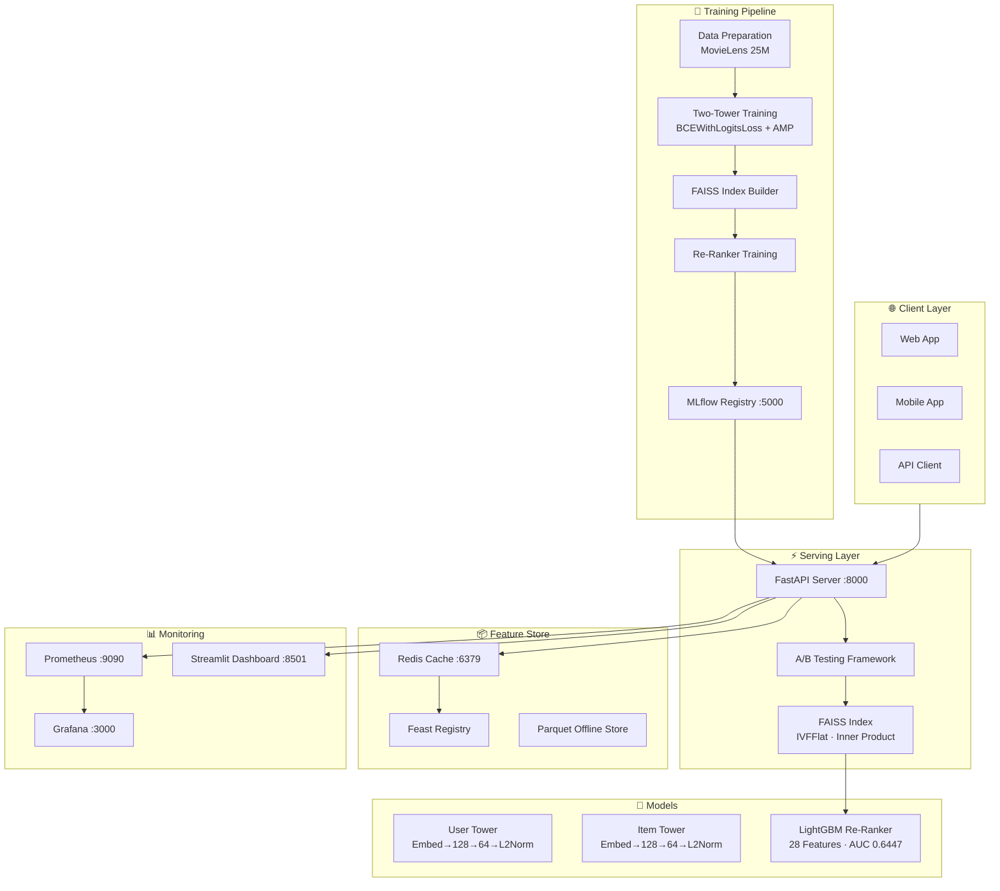
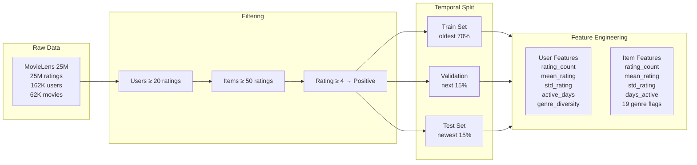
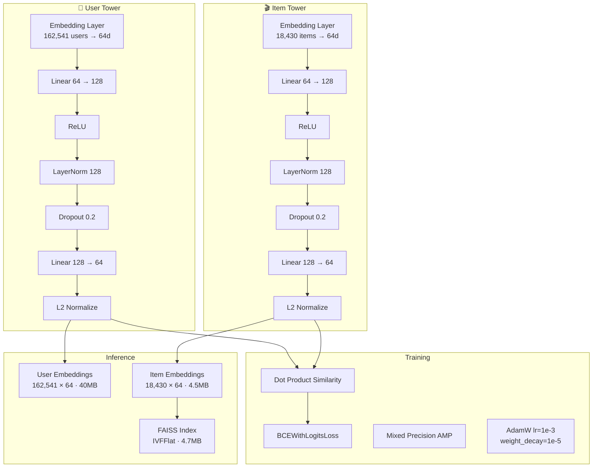
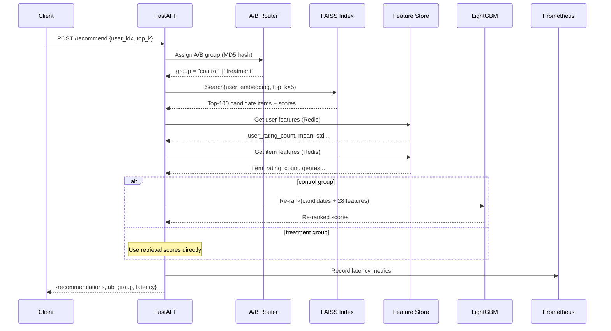
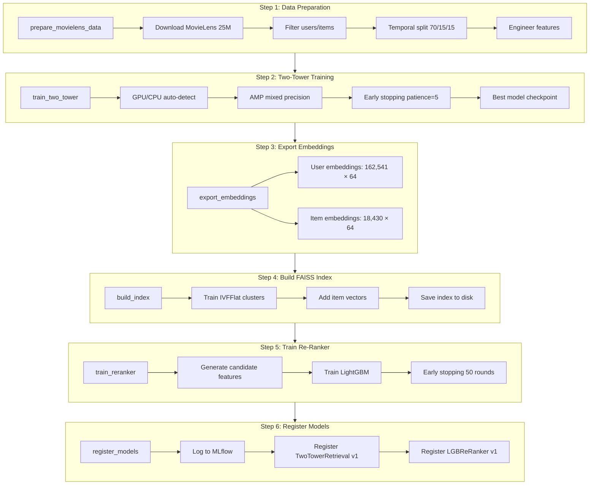
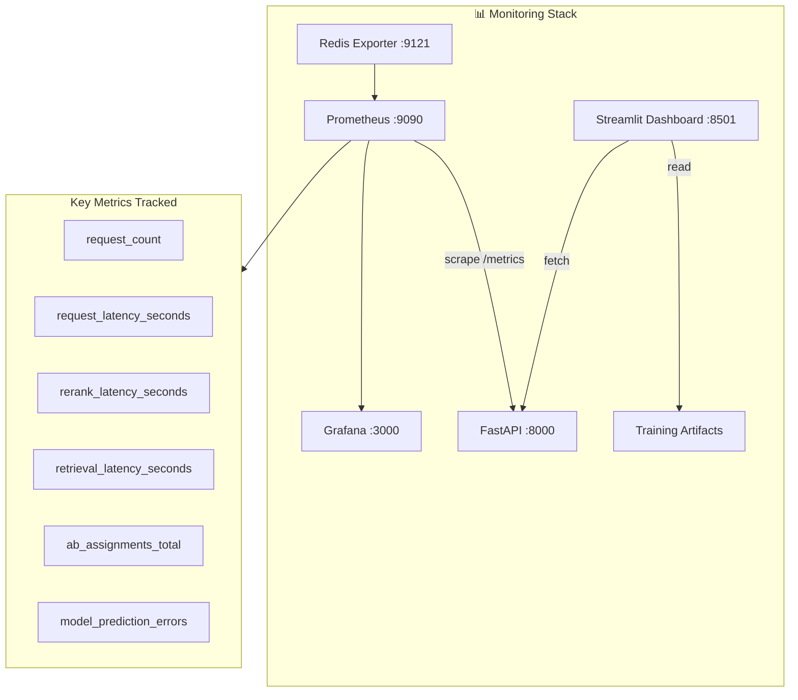

# 🎬 Production Recommendation System


> **An end-to-end, production-grade recommendation engine simulating how Netflix, Spotify, and YouTube deploy real-time recommendation systems at scale.** This project covers the full lifecycle — from data ingestion and feature engineering, through model training and offline evaluation, to real-time serving with A/B testing and comprehensive monitoring.

---

## 📑 Table of Contents

- [Project Overview](#-project-overview)
- [System Architecture](#-system-architecture)
- [Data Pipeline](#-data-pipeline)
- [Model Architecture](#-model-architecture)
  - [Two-Tower Retrieval Model](#two-tower-retrieval-model)
  - [LightGBM Re-Ranker](#lightgbm-re-ranker)
- [Feature Store](#-feature-store)
- [Serving Layer](#-serving-layer)
  - [API Endpoints](#api-endpoints)
  - [A/B Testing Framework](#ab-testing-framework)
- [Request Flow](#-request-flow)
- [Training Pipeline](#-training-pipeline)
- [Monitoring & Observability](#-monitoring--observability)
- [MLOps & Infrastructure](#-mlops--infrastructure)
  - [MLflow Model Registry](#mlflow-model-registry)
  - [Docker Compose Services](#docker-compose-services)
  - [CI/CD Pipeline](#cicd-pipeline)
- [Interactive Dashboard](#-interactive-dashboard)
- [Training Results](#-training-results)
- [Project Structure](#-project-structure)
- [Quick Start](#-quick-start)
- [API Usage Examples](#-api-usage-examples)
- [Technology Stack](#-technology-stack)
- [Configuration Reference](#-configuration-reference)

---

## 🎯 Project Overview

This project implements a **complete production recommendation system** that mirrors the architecture used by industry leaders. It goes far beyond a simple model notebook — it includes:

| Capability                        | Description                                                                                                                       |
| :-------------------------------- | :-------------------------------------------------------------------------------------------------------------------------------- |
| **Two-Stage Retrieval + Ranking** | A fast neural retrieval stage (Two-Tower model) to find candidates, followed by a feature-rich re-ranker (LightGBM) for precision |
| **Real-time Feature Store**       | Feast + Redis powered store with online, offline, and real-time feature serving                                                   |
| **Sub-millisecond Serving**       | FastAPI with FAISS approximate nearest neighbor search, achieving <1ms server-side latency                                        |
| **A/B Testing**                   | Built-in experimentation framework with deterministic MD5-based user bucketing and statistical significance testing               |
| **Full Observability**            | Prometheus metrics, Grafana dashboards, and a 6-page Streamlit analytics dashboard                                                |
| **GPU Acceleration**              | CUDA-enabled training and inference on NVIDIA GPUs (tested on RTX 3050 Laptop)                                                    |
| **MLOps Pipeline**                | MLflow experiment tracking, model versioning, Docker containerization, and GitHub Actions CI/CD                                   |

### What Makes This Production-Grade?

Unlike typical ML projects that stop at model training, this system addresses the **full deployment lifecycle**:

```
┌─────────────┐    ┌──────────────┐    ┌─────────────┐    ┌──────────────┐
│  Data Layer  │───▶│ Training &   │───▶│  Serving &   │───▶│ Monitoring & │
│  - Ingest    │    │  Evaluation  │    │  A/B Testing │    │ Observability│
│  - Features  │    │  - Two-Tower │    │  - FastAPI   │    │ - Prometheus │
│  - Store     │    │  - Re-Ranker │    │  - FAISS     │    │ - Grafana    │
│  - Stream    │    │  - MLflow    │    │  - Redis     │    │ - Streamlit  │
└─────────────┘    └──────────────┘    └─────────────┘    └──────────────┘
```

---

## 🏗 System Architecture

The system follows a modular microservices-inspired design with clear separation between data processing, model training, feature serving, and inference.



### Architecture Principles

1. **Two-Stage Retrieval + Ranking** — The retrieval stage narrows millions of items to ~100 candidates in microseconds using FAISS; the ranking stage uses rich features to precision-rank the final output.
2. **Online/Offline Feature Consistency** — Feast ensures the same features used in training are available at inference time, preventing training-serving skew.
3. **Stateless Serving** — The API server loads models at startup and serves requests statelessly, enabling horizontal scaling.
4. **Graceful Degradation** — When Redis is unavailable, the system falls back to retrieval-only scoring without blocking.

---

## 📊 Data Pipeline

The system uses the **MovieLens 25M** dataset — a well-established benchmark containing 25 million ratings from 162,000 users across 62,000 movies.



### Data Processing Steps

| Step                  | Input                 | Output                                    | Details                                        |
| :-------------------- | :-------------------- | :---------------------------------------- | :--------------------------------------------- |
| **Download**          | MovieLens 25M URL     | `ml-25m/ratings.csv`, `ml-25m/movies.csv` | Auto-download with progress bar                |
| **Filter Users**      | 162,541 users         | Users with ≥20 ratings                    | Ensures sufficient interaction history         |
| **Filter Items**      | 62,423 items → 18,430 | Items with ≥50 ratings                    | Removes cold-start items                       |
| **Binarize**          | 1-5 star ratings      | Binary (0/1)                              | Rating ≥ 4.0 → positive interaction            |
| **Temporal Split**    | Chronological sort    | 70/15/15 split                            | Prevents data leakage from future interactions |
| **Negative Sampling** | Positive-only data    | 4:1 neg:pos ratio                         | Random uninteracted items per user             |

### Feature Engineering

#### User Features (5 dimensions)

| Feature                | Description                        | Source                       |
| :--------------------- | :--------------------------------- | :--------------------------- |
| `user_rating_count`    | Total number of ratings by user    | Aggregated from interactions |
| `user_mean_rating`     | Average rating given by user       | Mean of all user ratings     |
| `user_std_rating`      | Rating variance of user            | Standard deviation           |
| `user_active_days`     | Days between first and last rating | Timestamp difference         |
| `user_genre_diversity` | Number of unique genres rated      | Genre count from movies      |

#### Item Features (9 static + 19 genre flags = 28 dimensions)

| Feature             | Description                                                                                                                                                                                    |
| :------------------ | :--------------------------------------------------------------------------------------------------------------------------------------------------------------------------------------------- |
| `item_rating_count` | Total ratings received                                                                                                                                                                         |
| `item_mean_rating`  | Average rating received                                                                                                                                                                        |
| `item_std_rating`   | Rating variance                                                                                                                                                                                |
| `item_days_active`  | Days item has been rated                                                                                                                                                                       |
| `genre_*` (×19)     | One-hot encoded genres: Action, Adventure, Animation, Children, Comedy, Crime, Documentary, Drama, Fantasy, Film-Noir, Horror, IMAX, Musical, Mystery, Romance, Sci-Fi, Thriller, War, Western |

### Event Streaming

The `EventGenerator` simulates real-time user activity with realistic probability distributions:

| Event Type  | Probability | Payload                                     |
| :---------- | :---------- | :------------------------------------------ |
| `click`     | 40%         | `{user_idx, item_idx, position}`            |
| `view`      | 30%         | `{user_idx, item_idx, watch_pct, duration}` |
| `rating`    | 15%         | `{user_idx, item_idx, rating}`              |
| `watchlist` | 10%         | `{user_idx, item_idx, action: add/remove}`  |
| `search`    | 5%          | `{user_idx, query, results_count}`          |

---

## 🧠 Model Architecture

### Two-Tower Retrieval Model

The retrieval model uses a **dual-encoder (Two-Tower)** architecture where user and item representations are learned independently and scored via dot product similarity — the same approach used by YouTube, Google, and Spotify.



#### Training Configuration

| Parameter           | Value             | Rationale                                   |
| :------------------ | :---------------- | :------------------------------------------ |
| Embedding dimension | 64                | Balance between expressiveness and memory   |
| Hidden dimension    | 128               | 2× embedding dim for capacity               |
| Learning rate       | 1×10⁻³            | Standard for embedding models               |
| Weight decay        | 1×10⁻⁵            | Light regularization                        |
| Batch size          | 4,096             | Large batches for stable gradient estimates |
| Max epochs          | 30                | With early stopping (patience=5)            |
| Dropout             | 0.2               | Prevents co-adaptation                      |
| Optimizer           | AdamW             | Decoupled weight decay                      |
| Loss                | BCEWithLogitsLoss | Binary classification of interactions       |
| AMP                 | FP16 (CUDA)       | 2× speedup, 50% memory reduction            |
| Max train samples   | 5,000,000         | Memory-safe cap for large datasets          |

#### Why Two-Tower?

The Two-Tower architecture has specific advantages for recommendation:

1. **Decoupled Encoding** — User and item embeddings are computed independently, enabling pre-computation and caching
2. **Sub-linear Retrieval** — Item embeddings are indexed once in FAISS; retrieval is O(log n) instead of O(n)
3. **Scalability** — Adding new items only requires encoding them through the item tower
4. **Serving Efficiency** — At inference time, only the user tower runs; item scores come from the pre-built index

### LightGBM Re-Ranker

The re-ranking stage takes the top candidates from retrieval and applies a feature-rich gradient boosted model to precision-rank them.

| Parameter         | Value                     |
| :---------------- | :------------------------ |
| Objective         | `binary` (classification) |
| Metric            | `auc`                     |
| Num leaves        | 31                        |
| Learning rate     | 0.05                      |
| Feature fraction  | 0.8                       |
| Bagging fraction  | 0.8                       |
| Bagging frequency | 5                         |
| Lambda L1         | 0.1                       |
| Lambda L2         | 0.1                       |
| Min child samples | 20                        |
| Num rounds        | 500                       |
| Early stopping    | 50 rounds                 |

#### Re-Ranker Feature Vector (28 features)

The re-ranker combines retrieval scores with rich user/item features:

```
[retrieval_score, user_rating_count, user_mean_rating, user_std_rating,
 user_active_days, user_genre_diversity, item_rating_count, item_mean_rating,
 item_std_rating, genre_Action, genre_Adventure, genre_Animation,
 genre_Children, genre_Comedy, genre_Crime, genre_Documentary, genre_Drama,
 genre_Fantasy, genre_Film-Noir, genre_Horror, genre_IMAX, genre_Musical,
 genre_Mystery, genre_Romance, genre_Sci-Fi, genre_Thriller, genre_War,
 genre_Western]
```

### FAISS Index

| Parameter        | Value              |
| :--------------- | :----------------- |
| Index type       | IVFFlat            |
| Metric           | Inner Product (IP) |
| nlist (clusters) | 100                |
| nprobe (search)  | 10                 |
| Dimensions       | 64                 |
| Vectors indexed  | 18,430             |
| Index size       | 4.7 MB             |

The FAISS index supports three index types configurable at build time:

- **Flat** — Exact brute-force search (highest accuracy, O(n))
- **IVFFlat** — Inverted file index (default, 10× faster with <1% accuracy loss)
- **HNSW** — Hierarchical Navigable Small World graph (fastest for high dimensions)

---

## 📦 Feature Store

The feature store is built on **Feast** with **Redis** as the online store and **Parquet files** as the offline store.

### Architecture

| Layer             | Technology            | Purpose                                                   |
| :---------------- | :-------------------- | :-------------------------------------------------------- |
| **Online Store**  | Redis (:6379)         | Low-latency feature lookups during inference (<1ms)       |
| **Offline Store** | Parquet files         | Historical features for training data generation          |
| **Registry**      | Feast Registry        | Feature definitions, entity schemas, data source mappings |
| **Manager**       | `FeatureStoreManager` | Unified API for materialize, get online/offline features  |

### Feature Definitions

```python
# Entity definitions
user = Entity(name="user_idx", value_type=ValueType.INT64)
item = Entity(name="item_idx", value_type=ValueType.INT64)

# Feature views with TTL = 1 day
user_features_view = FeatureView(
    name="user_features",
    entities=[user],
    schema=[
        Field(name="user_rating_count", dtype=Float32),
        Field(name="user_mean_rating", dtype=Float32),
        Field(name="user_std_rating", dtype=Float32),
        Field(name="user_active_days", dtype=Float32),
        Field(name="user_genre_diversity", dtype=Float32),
    ],
    ttl=timedelta(days=1),
    source=FileSource("data/user_features.parquet")
)
```

### Resilience

The feature store manager implements **graceful degradation**:

```
Redis Available? ──Yes──▶ Return rich features (28d vector)
         │
        No
         │
         ▼
    Return retrieval scores only (no re-ranking)
    Cache redis_available = False (avoid retries)
    socket_timeout = 1s, connect_timeout = 1s
```

---

## ⚡ Serving Layer

### API Endpoints

The FastAPI server exposes 5 endpoints for recommendation serving, event ingestion, health checking, metrics export, and A/B test configuration.

| Endpoint     | Method | Description                        | Response Time |
| :----------- | :----- | :--------------------------------- | :------------ |
| `/recommend` | POST   | Get personalized recommendations   | <1ms          |
| `/event`     | POST   | Ingest user interaction events     | <1ms          |
| `/health`    | GET    | Health check with component status | <1ms          |
| `/metrics`   | GET    | Prometheus metrics endpoint        | <1ms          |
| `/ab/config` | GET    | Current A/B test configuration     | <1ms          |

#### `/recommend` — Core Recommendation Endpoint

**Request:**

```json
{
  "user_idx": 42,
  "top_k": 10
}
```

**Response:**

```json
{
  "user_idx": 42,
  "recommendations": [
    { "item_idx": 1234, "score": 0.95, "rank": 1 },
    { "item_idx": 5678, "score": 0.91, "rank": 2 }
  ],
  "ab_group": "control",
  "model_version": "v1",
  "latency_ms": 0.8
}
```

#### `/health` — Component Health Check

```json
{
  "status": "healthy",
  "components": {
    "faiss_index": true,
    "user_embeddings": true,
    "reranker": true,
    "redis": false
  },
  "timestamp": "2025-01-15T10:30:00Z"
}
```

### A/B Testing Framework

The A/B testing framework enables controlled experimentation between different recommendation strategies.

| Feature                | Implementation                                                      |
| :--------------------- | :------------------------------------------------------------------ |
| **User Assignment**    | Deterministic MD5 hash of `f"{user_idx}_{experiment_name}"`         |
| **Bucketing**          | Hash modulo 100 → percentage-based group assignment                 |
| **Default Split**      | 50% control / 50% treatment                                         |
| **Significance Tests** | Welch's t-test (continuous metrics), Chi-squared (conversion rates) |
| **Confidence Level**   | 95% (α = 0.05)                                                      |

```python
# How A/B assignment works
hash_input = f"{user_idx}_reranker_experiment"
bucket = int(hashlib.md5(hash_input.encode()).hexdigest(), 16) % 100
group = "control" if bucket < 50 else "treatment"

# Control: Two-Tower retrieval + LightGBM re-ranking
# Treatment: Two-Tower retrieval scores only (no re-ranking)
```

---

## 🔄 Request Flow

This sequence diagram shows the complete lifecycle of a recommendation request:



### Latency Breakdown

| Stage            | Typical Latency | Notes                                 |
| :--------------- | :-------------- | :------------------------------------ |
| A/B Assignment   | <0.01ms         | MD5 hash computation                  |
| FAISS Retrieval  | ~0.1ms          | IVFFlat with nprobe=10                |
| Feature Lookup   | ~0.2ms          | Redis GET (when available)            |
| LightGBM Re-rank | ~0.3ms          | Score 100 candidates with 28 features |
| **Total**        | **<1ms**        | Server-side, excluding network        |

---

## 🔄 Training Pipeline

The training pipeline is orchestrated by `TrainPipeline` which executes 6 sequential steps:



### Pipeline Execution

```bash
# Run the complete pipeline
python -m src.mlops.train_pipeline --device auto

# Run individual steps
python -m src.data.prepare_data
python -m src.models.two_tower --device cuda
python -m src.models.faiss_index
python -m src.models.reranker
```

---

## 📊 Monitoring & Observability

The monitoring stack provides full visibility into system behavior across three layers:



### Prometheus Metrics

| Metric                                     | Type      | Description                             |
| :----------------------------------------- | :-------- | :-------------------------------------- |
| `recommendation_request_count`             | Counter   | Total recommendation requests served    |
| `recommendation_request_latency_seconds`   | Histogram | End-to-end request latency distribution |
| `recommendation_retrieval_latency_seconds` | Histogram | FAISS retrieval stage latency           |
| `recommendation_rerank_latency_seconds`    | Histogram | LightGBM re-ranking latency             |
| `recommendation_ab_assignments_total`      | Counter   | A/B group assignments by group name     |
| `recommendation_model_prediction_errors`   | Counter   | Model inference errors                  |

### Streamlit Dashboard (6 Pages)

The interactive Streamlit dashboard provides deep analytics:

| Page                      | Features                                                        |
| :------------------------ | :-------------------------------------------------------------- |
| **📈 Overview**           | System KPIs, request counts, latency gauges, component health   |
| **🎯 Training Metrics**   | Loss curves, learning rate schedule, epoch-level metrics        |
| **🔍 Embedding Explorer** | t-SNE/PCA visualization of user and item embeddings             |
| **🧠 Model Deep-Dive**    | Architecture diagrams, parameter counts, weight distributions   |
| **🎬 Live Recommender**   | Interactive demo: enter user ID → get real-time recommendations |
| **📊 Data Insights**      | Rating distributions, user activity patterns, genre popularity  |

---

## 🔧 MLOps & Infrastructure

### MLflow Model Registry

MLflow tracks all training experiments and versions production models:

| Component             | Details                                                                 |
| :-------------------- | :---------------------------------------------------------------------- |
| **Tracking URI**      | `http://localhost:5000`                                                 |
| **Experiment**        | `recommendation-system`                                                 |
| **Logged Params**     | embed_dim, hidden_dim, lr, batch_size, epochs, device                   |
| **Logged Metrics**    | train_loss, val_loss (per epoch), best_epoch, final_val_loss            |
| **Logged Artifacts**  | `two_tower_state.pt`, `item_index.faiss`, `reranker.lgb`, `config.json` |
| **Registered Models** | `TwoTowerRetrieval` (v1), `LGBReRanker` (v1)                            |

### Docker Compose Services

The entire system runs as 6 containerized services:

| Service          | Image                              | Ports | Purpose                              |
| :--------------- | :--------------------------------- | :---- | :----------------------------------- |
| `api`            | Custom (Dockerfile)                | 8000  | FastAPI recommendation server        |
| `redis`          | `redis:7-alpine`                   | 6379  | Online feature store cache           |
| `mlflow`         | `ghcr.io/mlflow/mlflow:v2.12.1`    | 5000  | Experiment tracking & model registry |
| `prometheus`     | `prom/prometheus:v2.51.0`          | 9090  | Metrics collection & alerting        |
| `grafana`        | `grafana/grafana:10.4.1`           | 3000  | Dashboards & visualization           |
| `redis-exporter` | `oliver006/redis_exporter:v1.58.0` | 9121  | Redis metrics for Prometheus         |

### CI/CD Pipeline

GitHub Actions workflow with 4 stages:

```yaml
# .github/workflows/ci.yml
jobs:
  test: # Run pytest suite
  build: # Build Docker image
  validate: # Validate model artifacts exist & metrics above threshold
  deploy: # Deploy to staging/production
```

| Stage        | Trigger                        | Actions                                                           |
| :----------- | :----------------------------- | :---------------------------------------------------------------- |
| **Test**     | Push to any branch             | `pip install -r requirements.txt` → `pytest tests/ -v --tb=short` |
| **Build**    | Push to main                   | `docker build -t recommendation-system`                           |
| **Validate** | After build                    | Check model files exist, validate metric thresholds               |
| **Deploy**   | After validation + main branch | `docker-compose up -d` → health check verification                |

---

## 🖥 Interactive Dashboard

The Streamlit dashboard provides a rich, interactive interface for exploring every aspect of the system.

### Dashboard Pages

#### 📈 Overview Page

Real-time system KPIs including total requests, average latency, active models, and component health status indicators.

#### 🎯 Training Metrics Page

Interactive Plotly charts showing training and validation loss curves, with epoch markers for the best checkpoint and early stopping point.

#### 🔍 Embedding Explorer

Dimensionality reduction (t-SNE or PCA) visualization of the 64-dimensional user and item embeddings, with interactive controls for perplexity, sample size, and color-coding by feature.

#### 🧠 Model Deep-Dive

Architecture breakdown showing parameter counts per layer, weight norm distributions, and model configuration details.

#### 🎬 Live Recommender

Interactive recommendation demo — enter any user ID and get real-time personalized recommendations with scores, A/B group assignment, and latency metrics.

#### 📊 Data Insights

Dataset exploration including rating distributions, user activity histograms, genre popularity bar charts, and temporal patterns.

---

## 📊 Training Results

Actual results from training on MovieLens 25M:

### Two-Tower Retrieval Model

| Metric               | Value                       |
| :------------------- | :-------------------------- |
| Best validation loss | **0.6035**                  |
| Best epoch           | 5 / 30                      |
| Early stopped at     | Epoch 8 (patience=5)        |
| Training device      | CUDA (RTX 3050 Laptop, 4GB) |
| Training time        | ~15 minutes                 |
| User embeddings      | 162,541 × 64 (39.6 MB)      |
| Item embeddings      | 18,430 × 64 (4.5 MB)        |
| Model checkpoint     | 44 MB                       |

### LightGBM Re-Ranker

| Metric             | Value                                    |
| :----------------- | :--------------------------------------- |
| Validation AUC     | **0.6447**                               |
| Number of features | 28                                       |
| Best iteration     | Determined by early stopping (50 rounds) |
| Model size         | 38 KB                                    |

### Generated Artifacts

| Artifact              | Size   | Description                 |
| :-------------------- | :----- | :-------------------------- |
| `two_tower_state.pt`  | 44 MB  | PyTorch model state dict    |
| `user_embeddings.npy` | 40 MB  | Pre-computed user vectors   |
| `item_embeddings.npy` | 4.5 MB | Pre-computed item vectors   |
| `item_index.faiss`    | 4.7 MB | FAISS IVFFlat search index  |
| `reranker.lgb`        | 38 KB  | LightGBM binary model       |
| `config.json`         | <1 KB  | Feature store configuration |
| `feature_names.json`  | <1 KB  | Ordered feature name list   |

---

## 📁 Project Structure

```
F:\Projects1DS19/
│
├── 📄 README.md                          # Quick-start documentation
├── 📄 PROJECT.md                         # This detailed documentation
├── 📄 requirements.txt                   # Python dependencies
├── 📄 dashboard.py                       # Streamlit analytics dashboard
│
├── 📂 src/
│   ├── 📂 data/
│   │   ├── prepare_data.py               # MovieLens download, filter, split, features
│   │   └── event_stream.py               # Real-time event simulation (5 types)
│   │
│   ├── 📂 models/
│   │   ├── two_tower.py                  # Two-Tower neural retrieval model
│   │   ├── faiss_index.py                # FAISS ANN index (Flat/IVFFlat/HNSW)
│   │   └── reranker.py                   # LightGBM gradient boosted re-ranker
│   │
│   ├── 📂 feature_store/
│   │   ├── feature_definitions.py        # Feast entity & feature view schemas
│   │   └── store_manager.py              # Online/offline feature serving + Redis
│   │
│   ├── 📂 serving/
│   │   ├── api.py                        # FastAPI server (5 endpoints)
│   │   └── ab_testing.py                 # A/B testing with statistical tests
│   │
│   ├── 📂 monitoring/
│   │   ├── metrics.py                    # Prometheus metric definitions
│   │   └── grafana_dashboard.json        # Pre-built Grafana dashboard config
│   │
│   └── 📂 mlops/
│       ├── train_pipeline.py             # 6-step orchestrated training pipeline
│       └── model_registry.py             # MLflow model versioning & registry
│
├── 📂 docker/
│   ├── Dockerfile                        # Multi-stage Python application image
│   ├── docker-compose.yml                # 6-service orchestration
│   └── prometheus.yml                    # Prometheus scrape configuration
│
├── 📂 tests/
│   ├── test_models.py                    # Model unit tests
│   ├── test_api.py                       # API endpoint tests
│   └── test_features.py                  # Feature store tests
│
├── 📂 .github/
│   └── workflows/
│       └── ci.yml                        # GitHub Actions CI/CD pipeline
│
└── 📂 artifacts/                         # Generated model artifacts (gitignored)
    ├── two_tower_state.pt
    ├── user_embeddings.npy
    ├── item_embeddings.npy
    ├── item_index.faiss
    ├── reranker.lgb
    ├── config.json
    └── feature_names.json
```

---

## 🚀 Quick Start

### Prerequisites

- Python 3.10+
- NVIDIA GPU with CUDA 12.4 (optional, falls back to CPU)
- Docker & Docker Compose (for full deployment)
- 8GB+ RAM recommended

### Installation

```bash
# Clone the repository
git clone https://github.com/yourusername/production-recommendation-system.git
cd production-recommendation-system

# Create virtual environment
python -m venv venv
source venv/bin/activate  # Linux/Mac
venv\Scripts\activate     # Windows

# Install dependencies
pip install -r requirements.txt

# Install PyTorch with CUDA (if GPU available)
pip install torch==2.6.0 --index-url https://download.pytorch.org/whl/cu124
```

### Run Training Pipeline

```bash
# Run the complete 6-step pipeline
python -m src.mlops.train_pipeline --device auto

# This will:
# 1. Download & preprocess MovieLens 25M (~1GB download)
# 2. Train Two-Tower model (5-10 epochs with early stopping)
# 3. Export user & item embeddings
# 4. Build FAISS search index
# 5. Train LightGBM re-ranker
# 6. Register models in MLflow
```

### Start the API Server

```bash
# Start FastAPI recommendation server
python -m src.serving.api

# Server runs at http://localhost:8000
# API docs at http://localhost:8000/docs
```

### Launch the Dashboard

```bash
# Start Streamlit analytics dashboard
streamlit run dashboard.py

# Dashboard available at http://localhost:8501
```

### Full Docker Deployment

```bash
# Start all 6 services
docker-compose -f docker/docker-compose.yml up -d

# Services:
# - API:        http://localhost:8000
# - MLflow:     http://localhost:5000
# - Prometheus: http://localhost:9090
# - Grafana:    http://localhost:3000
# - Redis:      localhost:6379
```

---

## 📡 API Usage Examples

### Get Recommendations

```bash
curl -X POST http://localhost:8000/recommend \
  -H "Content-Type: application/json" \
  -d '{"user_idx": 42, "top_k": 5}'
```

### Track User Event

```bash
curl -X POST http://localhost:8000/event \
  -H "Content-Type: application/json" \
  -d '{
    "event_type": "click",
    "user_idx": 42,
    "item_idx": 1234,
    "metadata": {"position": 3}
  }'
```

### Check System Health

```bash
curl http://localhost:8000/health
```

### View A/B Test Config

```bash
curl http://localhost:8000/ab/config
```

### Python Client Example

```python
import requests

# Get recommendations for user 42
response = requests.post(
    "http://localhost:8000/recommend",
    json={"user_idx": 42, "top_k": 10}
)
recs = response.json()

print(f"A/B Group: {recs['ab_group']}")
print(f"Latency: {recs['latency_ms']:.2f}ms")
for item in recs["recommendations"]:
    print(f"  #{item['rank']}: Item {item['item_idx']} (score: {item['score']:.4f})")
```

---

## 🛠 Technology Stack

| Category                | Technologies                                        |
| :---------------------- | :-------------------------------------------------- |
| **Deep Learning**       | PyTorch 2.6.0 (CUDA 12.4), Mixed Precision (AMP)    |
| **Gradient Boosting**   | LightGBM 4.6                                        |
| **Vector Search**       | FAISS (CPU/GPU), IVFFlat / HNSW                     |
| **Feature Store**       | Feast, Redis 7                                      |
| **API Framework**       | FastAPI, Uvicorn, Pydantic                          |
| **Experiment Tracking** | MLflow 2.12                                         |
| **Monitoring**          | Prometheus, Grafana 10.4, prometheus-client         |
| **Dashboard**           | Streamlit 1.53, Plotly 6.6                          |
| **Containerization**    | Docker, Docker Compose                              |
| **CI/CD**               | GitHub Actions                                      |
| **Data**                | Pandas, NumPy, Scikit-learn                         |
| **Dataset**             | MovieLens 25M (25M ratings, 162K users, 62K movies) |

---

## ⚙ Configuration Reference

### Environment Variables

| Variable              | Default                 | Description                             |
| :-------------------- | :---------------------- | :-------------------------------------- |
| `REDIS_HOST`          | `localhost`             | Redis server hostname                   |
| `REDIS_PORT`          | `6379`                  | Redis server port                       |
| `MLFLOW_TRACKING_URI` | `http://localhost:5000` | MLflow server URI                       |
| `MODEL_DIR`           | `artifacts/`            | Directory for model artifacts           |
| `DEVICE`              | `auto`                  | Training device (`auto`, `cuda`, `cpu`) |

### Model Hyperparameters

```python
# Two-Tower Model
NUM_USERS = 162_541      # Auto-detected from data
NUM_ITEMS = 18_430       # Auto-detected from data
EMBED_DIM = 64           # Embedding dimension
HIDDEN_DIM = 128         # Hidden layer dimension
LEARNING_RATE = 1e-3     # AdamW learning rate
WEIGHT_DECAY = 1e-5      # L2 regularization
BATCH_SIZE = 4096         # Training batch size
MAX_EPOCHS = 30          # Maximum training epochs
PATIENCE = 5             # Early stopping patience
DROPOUT = 0.2            # Dropout rate

# LightGBM Re-Ranker
NUM_LEAVES = 31
LGB_LEARNING_RATE = 0.05
FEATURE_FRACTION = 0.8
BAGGING_FRACTION = 0.8
NUM_ROUNDS = 500
EARLY_STOPPING = 50

# FAISS Index
INDEX_TYPE = "IVFFlat"   # Flat, IVFFlat, or HNSW
METRIC = "IP"            # Inner Product
NLIST = 100              # Number of clusters
NPROBE = 10              # Clusters to search
```

---

## 📜 License

This project is licensed under the MIT License — see the [LICENSE](LICENSE) file for details.

---

<div align="center">

**Built with ❤️ as a demonstration of production ML system design**

_Simulating how Netflix, Spotify, and YouTube deploy recommendation systems at scale_

</div>
